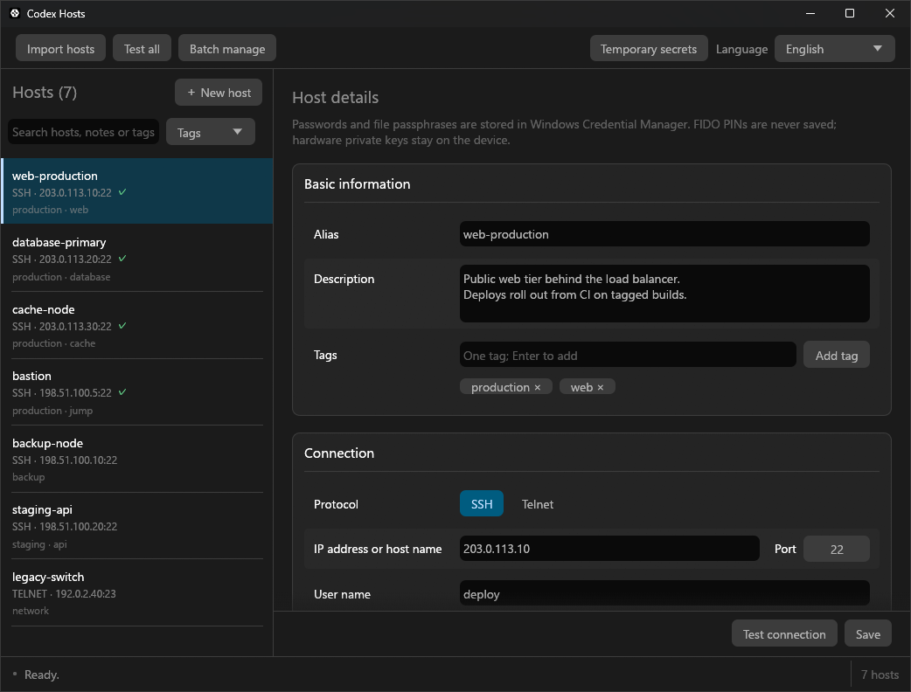

# codex-hosts

[English](../../README.md) | [简体中文](README_zh-CN.md) | [繁體中文](README_zh-TW.md) | [日本語](README_ja.md)

`codex-hosts` 是一个供 Codex 使用的 Windows SSH / Telnet 主机管理工具，让 Codex 无需接触或输入明文密码即可安全发起连接。



## 主要功能

- 保存别名、地址、端口、用户名、协议、身份验证方式、可选私钥路径、已信任的 SSH 主机密钥和可选跳板主机。
- 支持 SSH 密码与键盘交互验证，以及带可选口令的 OpenSSH 私钥。
- 密码和私钥口令仅存入 Windows 凭据管理器。
- 使用已保存且验证通过的 SSH 主机构建多层跳板链。
- 可用于已明确接受风险的传统 Telnet 环境；Telnet 凭据和流量均不加密。
- Codex 可以预先创建指定别名的草稿并等待保存、信任或取消，无需在对话中询问凭据。

## 安装

### 下载 Release

预编译包支持 64 位 Windows 10 或更高版本，可从 [Releases](https://github.com/Torinomii/codex-hosts/releases/latest) 下载。手动运行 `Build release` 工作流时，会直接读取 `Cargo.toml` 的版本并生成对应标签（例如 `version = "0.1.0"` 生成 `v0.1.0`）；构建成功后会自动创建 GitHub Release。

### 从源代码安装

源代码构建需要 Rust 1.92 或更高版本以及 MSVC 工具链：

```
git clone https://github.com/Torinomii/codex-hosts.git
cd codex-hosts
cargo build --locked --release
```

将 `target\release\codex-hosts.exe` 复制到 `skill\codex-hosts\bin\codex-hosts.exe`，然后把完整的 `skill\codex-hosts` 目录安装为 `%USERPROFILE%\.codex\skills\codex-hosts`。

### Codex 通用安装提示词

```text
安装 codex-hosts：自动识别当前环境的 Skill 安装目录，并将完整的 codex-hosts Skill 安装到正确位置，确认可执行文件及必要配置文件存在。
```

## Codex 集成

仓库在 `skill\codex-hosts` 中提供了可移植的 Codex skill。安装后，`SKILL.md` 会相对于已安装的 skill 目录定位 `bin\codex-hosts.exe`，无需修改仓库相关的绝对路径。

GUI 编辑模式允许传入非敏感预填信息：

```
.\bin\codex-hosts.exe --codex-edit `
  --alias example `
  --host server.example.com `
  --port 22 `
  --user operator `
  --protocol ssh `
  --auth password `
  --result-file result.json
```

切勿通过对话、命令行参数、JSON、脚本或日志传递密码或私钥口令。用户只能在 GUI 的遮罩输入框中填写凭据。

工具模式通过同一个可执行文件读取不含凭据的请求文件并写入结果文件：

```json
{"action":"list_hosts"}
{"action":"probe","alias":"example"}
{"action":"exec","alias":"example","command":"hostname"}
```

`probe` 和 `exec` 可以按单次操作设置 `connect_timeout_ms` 与 `command_timeout_ms`；无需应用层超时时应省略。已保存主机不包含固定超时，远程命令会原样发送，不会猜测远端操作系统。

## 安全边界

- 密码和私钥口令只保存在 Windows 凭据管理器中，绝不会返回给 Codex。
- SSH 指纹必须明确固定，应用不会自动替换。
- 只有已验证的 SSH 配置才能作为跳板；跳板链会检查循环并限制为最多八台主机。
- Telnet 为明文协议，只应在明确接受该风险的可信网络中使用。
- 每个输出流最多捕获一 MiB 命令输出。
